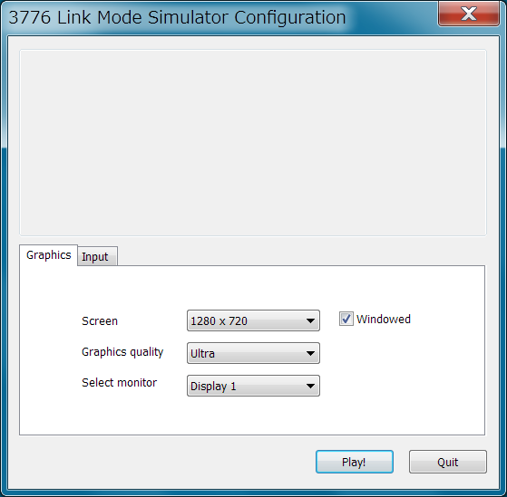
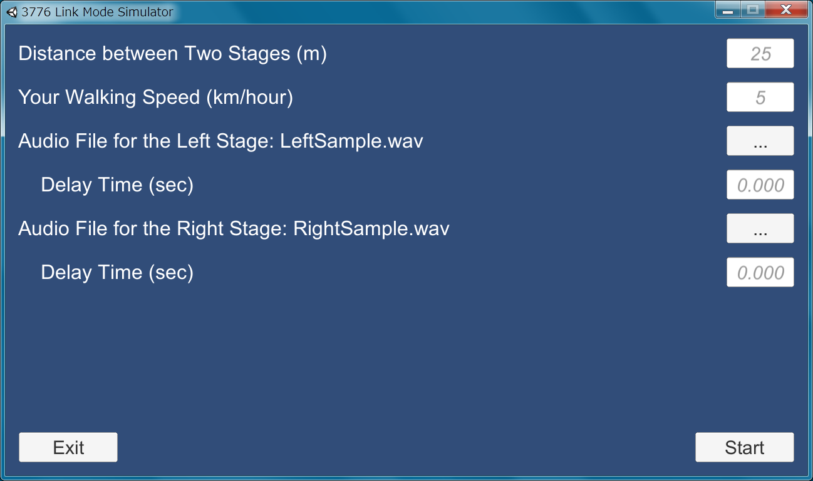
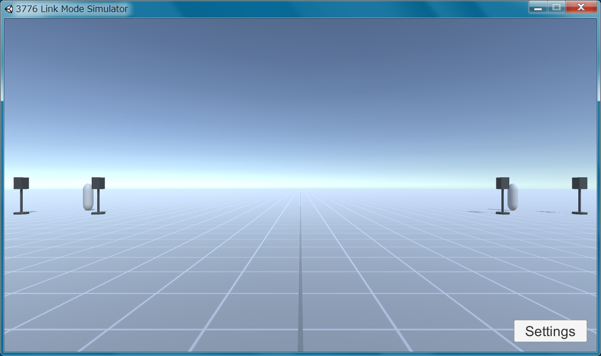

# 3776 Link Mode simulator

富士山ご当地アイドルグループ「3776（みななろ）」のライブを再現？できます。  
アルバム「公開実験」の静岡版／山梨版の両方の音楽ファイル（wavフォーマット）が必要です。

## 動作確認環境

Windows 7

## ダウンロード

[3776lms.zip](https://github.com/inaniwa3/3776-simulator/releases/download/v0.0.0/3776lms.zip)

## インストール

ダウンロードしたzipファイルを解凍してください。  
解凍したフォルダ内にある「3776lms.exe」をクリックすると、ソフトウェアが起動します。

## アンインストール

解凍したフォルダごと削除してください。

## 使い方

### 解像度設定画面

特にこだわりがなければ、そのまま「Play!」をクリックしてください。

* Windowed
    * チェックを外すと、フルスクリーンで起動します。

### 設定画面

* Distance between Two Stages (m)
    * 2ステージ間の距離（メートル）です。
    * 25mくらいがよいそうです。離しすぎると、音速の影響を受けやすくなります。
* Your Walking Speed (km/hour)
    * あなたの移動速度（キロメートル毎時）です。
    * 速くすると、ドップラー効果がかかるのがわかります。ただ、速すぎると音楽の同期がずれてしまうので、ご注意ください。
* Audio File for the Left/Right Stage
    * 向かって左／右側のステージから流れる音楽ファイルです。
    * wavフォーマット（サンプリング周波数48kHz以下）にしか対応していません。ない場合は自前で用意しておく必要があります。
        * OTOTOYで買えるwavファイルはサンプリング周波数が96kHzなので、48kHz以下に変換する必要があります（96kHzのままでも一応再生できますが、ノイズが乗る場合があります）。
        * wavファイルを96kHzから48kHzに変換するのには「[SoundEngine Free](http://soundengine.jp/software/soundengine/)」が使えます。手順は「[フォーマット変換画面](http://soundengine.jp/wordpress/soundengine_help/index/view/format_convert_view/)」に詳しいです。
    * ファイル選択後、選択したファイル名が表示されるまで、しばらく待つ場合があります。この間は、選択した音楽ファイルをロードしています。
* Delay Time (sec)
    * 頭出しのために、音楽ファイルの再生開始を遅らせる時間（秒）です。
    * 各曲以下のように設定すると、だいたいタイミングがあうようです。

        | 曲名 | 山梨版 | 静岡版 |
        | ---- |:------:|:------:|
        | 私のものです! | 4.700 | 0.000 |
        | もうちょっとおやすみ | 0.000 | 4.000 |
        | 桃としらすの歌 | 0.000 | 6.957 |
        | 見えない | 0.000 | 3.334 |
* Start
    * ライブが始まります。
* Exit
    * ソフトウェアを終了します。

### ライブ画面

設定画面で選択した音楽がループ再生されます。ヘッドフォンで聴くのがオススメです。  
床の1マスは、1m四方に相当します。

* 移動
    * カーソルキーの上下左右、もしくは「W」「S」「A」「D」キーで、前後左右に移動します。
* 回転
    * マウスの左クリックを押しながら、マウスを左に移動させると左回転、右に移動させると右回転します。
* Settings
    * 設定画面に戻ります。

## 音楽素材

サンプルとして、以下のフリーの音楽素材を一部加工して使用しています。

* LeftSample.wav
    * 「[アラブの遺跡](http://dova-s.jp/bgm/play7444.html)」 written by Yuli
* RightSample.wav
    * 「[glitch piano](http://dova-s.jp/bgm/play7216.html)」 written by Yuli

## その他

* 確認してませんが、以下の音楽にも使えると思います。
    * Cornelius 「STAR FRUITS SURF RIDER」
    * The Flaming Lips 「Zaireeka」（※内2曲）
